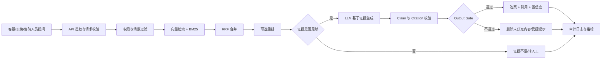
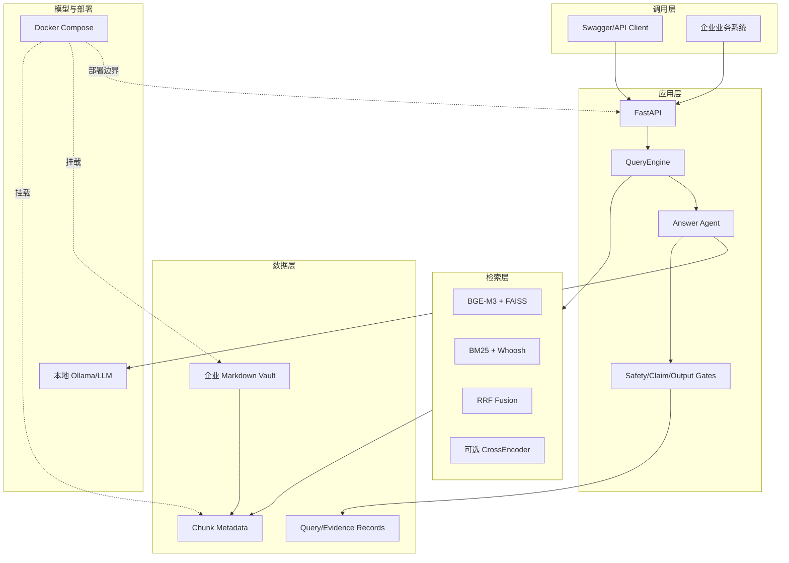
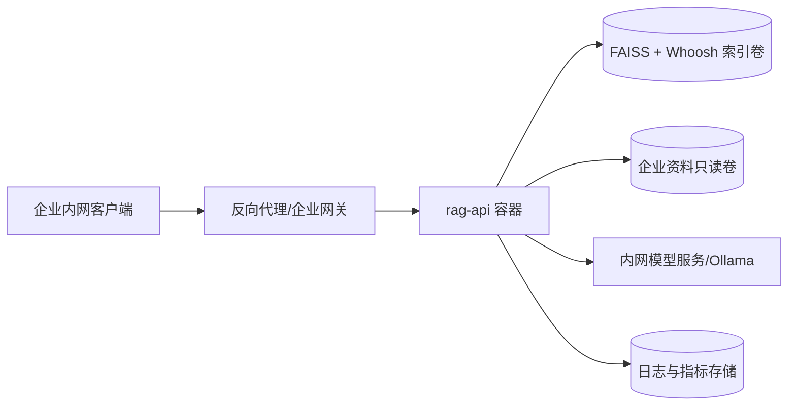

# 企业知识库 RAG 售前架构说明

本文对应企业知识库 Demo，定位为“基于模拟企业资料的 RAG POC 和售前参考实现”。

## 业务流程

## 技术架构

## 部署架构

### 组件职责

| 组件 | 当前 Demo 职责 | 售前说明 |
|---|---|---|
| FastAPI | 鉴权、限流、查询接口、健康检查 | 可对接企业应用，但生产环境还需网关、监控和告警 |
| FAISS | 向量相似度召回 | 适合本地 POC；大规模部署需评估向量数据库 |
| Whoosh | BM25 关键词召回 | 对产品名、错误码、版本号等精确词有效 |
| RRF | 合并向量和关键词结果 | 兼顾语义检索与精确匹配 |
| Ollama | 本地回答生成和语义证据判断 | POC 使用本地模型；客户环境需确认模型、GPU 和授权 |
| Vault | 文档、FAQ、权限和部署资料 | 资料版本、权限和审核状态需要由客户提供 |
| Docker Compose | 复现 API 和索引运行环境 | 适合 Demo/小规模部署，不等于完整生产运维方案 |

## 客户需求映射

| 客户问题 | 方案回答 | 需要继续确认 |
|---|---|---|
| 资料从哪里来 | 产品手册、FAQ、故障记录、权限和部署文档 | 数据所有者、更新频率、敏感级别 |
| 如何避免乱答 | Citation、Claim 校验、Output Gate、无依据转人工 | 可接受的拒答率和人工审核流程 |
| 如何保证权限 | 当前 Demo 使用领域过滤和资料边界 | 真实 ACL、SSO、组织架构、行级权限 |
| 如何更新文档 | 重新索引并通过健康检查 | 增量索引、灰度发布、版本回滚 |
| 如何私有化 | API、索引、资料和模型服务可分开部署 | GPU、并发、网络、日志、备份和运维责任 |

## 当前边界

- 当前企业 Demo 已实现 `domain=enterprise` 过滤，但没有接入真实用户 ACL 或 SSO。
- 当前版本信息主要通过文档 ID、标题、正文和来源表达，尚未实现正式的 `version` metadata 过滤。
- FAISS + Whoosh 适合本地 POC，百万级文档和高并发需要重新评估存储与检索架构。
- Docker Compose 证明可复现部署，不代表已经完成生产级高可用、监控、告警和灾备。
